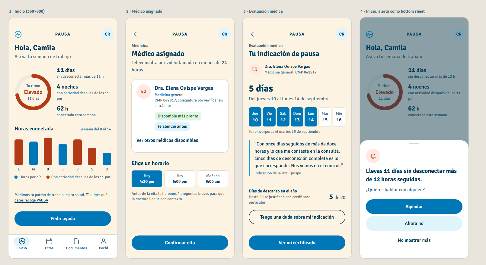

# Sistema de diseño · PAUSA (D4) — propuesta para el punto de control

Estado: **aprobado el 11 de septiembre de 2026** e implementado en todas las pantallas (Fase 3). Los tokens viven en código en `src/styles/tokens.css` (copia de referencia en `docs/maquetas/tokens.css`). La maqueta de las pantallas clave está en `docs/maquetas/maquetas-fase2.html` y su captura en `docs/capturas/fase2-maquetas.png`.

---

## 1. Diagnóstico confirmado del estado actual (`legacy/index.html`)

Medido con `grep` y con `scripts/contraste.mjs --legacy` el 10 de septiembre de 2026:

| Eje | Medición propia | Coincide con el diagnóstico del prompt |
|---|---|---|
| Pesos tipográficos | `font-weight:800` ×37, `700` ×17, `600` ×11, `400` ×0 | Sí |
| Contraste | `#6B7280` sobre `#FDF3E3` = 4,40:1 · blanco sobre `#00A0DF` = 2,96:1 · `#FF5C35` sobre blanco = 3,07:1 · `#00A0DF` como ícono sobre blanco = 2,96:1 (falla 1.4.11) | Sí, y se suma la falla de no-texto |
| Estructura | 1 sola sombra (`--shadow`) para tarjetas, botones redondos, campos y píldoras; 2 gradientes decorativos; `.sect` y `.field label` en mayúsculas espaciadas; cadenas "A · B · C" en tiles, chips y subtítulos | Sí |
| Layout | `.stage` 390×844 fijo, barra "9:41", `sysnav` simulado, `.content` 749 px, `.btn-fixed` 350 px, `user-scalable=no`, `overflow:hidden` ×15, 0 contenedores con scroll | Sí |
| Movimiento | Ripple infinito + wobble en Reloj, spinner + shimmer en Médico, ringbell, stagger en 6 pantallas; ninguna consulta `prefers-reduced-motion` | Añadido: sin movimiento reducido |

---

## 2. Tokens de color y sus roles

Paleta base **intacta**: `#00A0DF` `#003B5C` `#FF5C35` `#2FA84F` `#FDF3E3`. Todo lo demás es un **tono derivado** de esos cinco (mezcla lineal en sRGB con blanco, negro, crema o entre sí), documentado con su receta y su rol. No hay matices nuevos.

| Token | Hex | Receta | Rol semántico |
|---|---|---|---|
| `--azul` | `#00A0DF` | base | **Acento no textual**: logo, indicador del anillo de identidad, borde de cita. Nunca texto ni componente informativo (2,96:1 sobre blanco) |
| `--azul-700` | `#0077B6` | azul oscurecido (ya existía en el código) | **Primario**: relleno de botón primario, barras del gráfico, celdas seleccionadas, relleno del loader. Blanco encima: 4,87:1 |
| `--azul-100` | `#E0F4FB` | azul 12 % + blanco 88 % | Tinte informativo: botón tonal, chips informativos, indicador de pestaña activa |
| `--navy` | `#003B5C` | base | **Texto principal**, títulos, pestaña activa, borde del botón de contorno |
| `--navy-600` | `#3F697E` | navy 75 % + crema 25 % | **Texto secundario** (5,41:1 sobre crema). Sustituye al gris `#6B7280` |
| `--navy-300` | `#7393A5` | navy 55 % + blanco 45 % | Solo estados deshabilitados (exentos por WCAG) |
| `--naranja` | `#FF5C35` | base | Acento de atención no textual: punto de aviso sobre blanco (3,07:1), rellenos junto a texto explicativo |
| `--naranja-700` | `#B23A17` | naranja oscurecido 30 % (ya existía) | **Alerta**: texto e ícono de atención, arco del anillo en estado "Elevado", barras de noches (5,44:1 sobre crema) |
| `--naranja-100` | `#FFE9E1` | naranja 12 % + blanco | Tinte de atención (chips, avatar del médico, ícono del sheet) |
| `--verde` | `#2FA84F` | base | Acento de éxito no textual, solo junto a texto (3,07:1 sobre blanco) |
| `--verde-700` | `#1E7A3A` | verde oscurecido 30 % (ya existía) | **Éxito**: texto e ícono de completado, check del trámite (4,90:1 sobre crema) |
| `--verde-100` | `#E3F5E8` | verde 12 % + blanco | Tinte de éxito |
| `--crema` | `#FDF3E3` | base | **Fondo** de toda la app |
| `--crema-050` | `#FEF9F1` | crema 50 % + blanco | Fila pulsada, fondo de campo |
| `--crema-200` | `#F0EADC` | crema + navy 5 % | Pista del anillo y de las barras, separadores suaves |
| `--crema-300` | `#D7D7CF` | crema + navy 15 % | Contorno hairline del nivel 1 |
| `--blanco` | `#FFFFFF` | base | **Superficie** de nivel 1 y 2, texto sobre primario |

Roles (alias que usa el código): `--c-fondo`, `--c-superficie`, `--c-primario` / `--c-sobre-primario`, `--c-primario-tinte`, `--c-acento`, `--c-texto`, `--c-texto-2`, `--c-alerta` (+ `-acento`, `-tinte`), `--c-exito` (+ `-acento`, `-tinte`), `--c-contorno`, `--c-scrim`.

**Un solo acento dominante por pantalla:** Inicio en estado elevado usa alerta (naranja-700) en el anillo y las noches; Médico asignado usa primario; Evaluación usa primario; Trámite usa éxito. El azul base solo aparece en el logo.

### 2.1 Tabla de contraste (WCAG 2.2, 1.4.3 y 1.4.11)

Generada con `scripts/contraste.mjs`; la tabla completa está en `docs/contraste-tabla.md`. Resumen: **32 de 34 pares pasan**. Los dos que fallan están fuera del alcance de la norma y se usan solo así:

| Par | Ratio | Por qué es aceptable |
|---|---|---|
| `#00A0DF` (azul base) sobre crema | 2,69:1 | Solo logo y decoración; nunca transmite información por sí solo |
| `#7393A5` (navy-300) sobre crema | 2,96:1 | Solo texto deshabilitado; 1.4.3 exime los componentes inactivos |

Pares críticos que sí pasan: texto secundario `#3F697E` sobre crema **5,41:1**; blanco sobre botón `#0077B6` **4,87:1**; naranja-700 sobre crema **5,44:1**; verde-700 sobre tinte verde **4,74:1**; loader: navy sobre crema **10,73:1** y blanco sobre relleno **4,87:1** en todo momento de la transición (ver 7.1).

---

## 3. Escala tipográfica

Familia: **Signika** (OFL 1.1), variable 300–700, un solo archivo `Signika-latin.woff2` de 42 KB empaquetado localmente; respaldo `"Segoe UI", Roboto, system-ui, sans-serif`. Justificación en `docs/estudio-de-mercado.md` §1.2 (sustituto abierto más cercano a Foco, la fuente propietaria de Pacífico).

Seis pasos, **tres pesos** (400, 600, 700). La jerarquía se construye con tamaño y peso; el color secundario solo distingue texto de apoyo.

| Token | Tamaño / interlineado | Peso | Uso |
|---|---|---|---|
| `--t-display` | 32 / 40 | 700 | Cifra protagonista ("5 días"), "Inhala" / "Exhala" |
| `--t-headline` | 24 / 32 | 700 | Título de pantalla (uno por pantalla) |
| `--t-title` | 18 / 24 | 600 | Título de grupo, nombre del profesional, valor de métrica |
| `--t-body` | 16 / 24 | 400 | Texto base, subtítulos, frase del médico |
| `--t-label` | 14 / 20 | 600 | Chips, etiquetas de campo, pestañas, eyebrow |
| `--t-caption` | 13 / 18 | 400 | Notas, leyendas, fechas |
| `--t-button` | 16 / 24 | 600 | Botones |

Reglas: sin mayúsculas espaciadas (los eyebrows van en `label` con capitalización normal); sin cadenas con puntos medios (se reemplazan por frases o por dos líneas); sin `letter-spacing` negativo salvo −0,01 em en display. Con la fuente del sistema al 130 % los pasos usan `rem`, así que escalan; los contenedores no tienen alturas fijas.

---

## 4. Espaciado, radios, elevación y tacto

- **Espaciado** en escala 4/8: 4, 8, 12, 16, 20, 24, 32, 48. Margen lateral de pantalla 20 dp.
- **Radios por jerarquía:** 8 (chips, celdas de calendario, horarios), 12 (filas accionables, campos), 16 (tarjetas), 24 (bottom sheet y visor), completo (botones y avatares). Coincide con Pacífico (chips 8, tarjetas 16–20, botones píldora) y con la escala de formas de M3.
- **Elevación: dos niveles con significado.**
  - Nivel 0 (defecto): todo lo informativo va sobre la crema, separado por espacio y hairlines. Sin tarjetas.
  - Nivel 1, "superficie accionable": blanco + contorno hairline `#D7D7CF`, sin sombra. Solo cuando agrupa algo que se puede tocar (tarjeta del médico con "ver otros", grilla de horarios, filas de documentos).
  - Nivel 2, "flotante": sombra azulada `0 12px 32px -8px rgba(0,59,92,.28)`. Solo bottom sheet, visor de documento, toast.
  - Se eliminan: sombra en botones y campos, botones redondos con sombra, gradientes de botón y del hero.
- **Tacto:** 48 dp mínimo en todo control (botones, pestañas, chips de horario, celdas, ícono de atrás, avatar). Cumple Material (48 dp) y Apple HIG (44 pt).

---

## 5. Decisiones de concordancia con Pacífico

Resumen de `docs/estudio-de-mercado.md` §3:

1. Signika como sustituto abierto de Foco.
2. El azul se oscurece para leer y pulsar, como hace Pacífico con `#0099CC` → `#0080AA` / `#0075B0`.
3. Iconografía de línea, 1,75 px sobre 24, extremos redondeados, un solo set.
4. Botones píldora planos de 48 dp; secundario tonal; terciario de texto subrayado.
5. Radios 8 / 12 / 16 / 24 / completo.
6. Sombra azulada, corta, solo en el nivel flotante.
7. Tarjeta de profesional con colegiatura visible y horarios como chips en grilla (patrón de las apps peruanas de citas).
8. Tono: tuteo, frases cortas, sin urgencia promocional.

---

## 6. Pantallas clave (maqueta estática)

| Pantalla | Qué muestra la maqueta |
|---|---|
| **Inicio** | Anillo de ritmo en naranja-700 sobre pista crema-200, con tres métricas como lista plana (cifra en title 600, explicación en caption). Gráfico semanal sin tarjeta: barras primario y barras de alerta en las noches con actividad, día actual resaltado. Nota de privacidad con el copy corregido: "Tú eliges qué datos recoge PAUSA" (enlace a Perfil). CTA "Pedir ayuda" fijo sobre la barra de pestañas; pestañas con indicador píldora y sin negrita en la activa |
| **Médico asignado** | Eyebrow "Medicina", título, subtítulo sin puntos medios. Única tarjeta de nivel 1: avatar con iniciales, nombre, especialidad, CMP visible con la nota "por verificar en el trámite", chips de estado y enlace "Ver otros médicos disponibles". Horarios en grilla de 3 con celdas de 56 dp; nota que anticipa la pre-consulta |
| **Evaluación médica ("Tu indicación de pausa")** | Médico que indica, cifra display "5 días", rango de fechas, tira de calendario con los N días encendidos (en la app se encienden uno a uno con háptica), reincorporación, frase del médico como cita con borde azul, contador "Días de descanso en el año: 5 de 20" con la explicación de los 20 días, botón de contorno "Tengo una duda sobre mi indicación" y CTA "Ver mi certificado". Sin controles para editar días |
| **Inicio con alerta** | La alerta como bottom sheet (nivel 2): handle, ícono de atención en tinte naranja, título en headline reducido, tres acciones (primario, tonal, texto) |

---

## 7. Sistema de movimiento (tokens)

| Token | Valor | Uso |
|---|---|---|
| `--d-micro` | 120 ms | Pulsación, cambio de estado de un chip |
| `--d-trans` | 280 ms | Transición de pantalla (eje compartido X), apertura de sheet |
| `--d-enfasis` | 600 ms | Llenado del anillo y de las barras, revelación de días |
| `--ease-out` | `cubic-bezier(.2,.8,.2,1)` | Entradas |
| `--ease-in-out` | `cubic-bezier(.4,0,.2,1)` | Transiciones simétricas |
| Spring | `{ stiffness: 320, damping: 32 }` (Motion) | Bottom sheet y gestos |
| `--respira-inhala` / `--respira-exhala` | 4 s / 6 s | Loader; ciclo de 10 s (< 10 rpm) |

Reglas: una animación ambiental por pantalla como máximo; solo `transform` y `opacity`; `prefers-reduced-motion` reemplaza desplazamientos por fundidos y el relleno del loader por un cambio de opacidad.

### 7.1 Loader de respiración

- Relleno `#0077B6` que sube desde abajo con `transform: translateY()`; encima, "Inhala" / "Exhala" en display.
- El texto se dibuja dos veces: en navy sobre la crema y en blanco dentro del contenedor del relleno (que lleva `overflow:hidden` y un contra-`translateY` para que el texto no se mueva). Así la parte cubierta y la descubierta cumplen contraste en **todo** el recorrido: 10,73:1 y 4,87:1.
- Cambio de palabra con fundido cruzado en el punto de giro; háptica muy ligera opcional en cada cambio de fase.
- Salida: cuando el contenido está listo, se espera el final de la fase en curso; nunca se corta una exhalación. Las cargas simuladas duran fases completas (una inhalación + una exhalación = 10 s; en modo presentador, un ciclo).
- Lectores de pantalla: un único `aria-live` con "Buscando médico de tu red"; las palabras Inhala/Exhala van con `aria-hidden`.

---

## 8. Qué cambió y por qué (frente al diagnóstico)

| Antes (`legacy/index.html`) | Ahora | Por qué |
|---|---|---|
| Nunito 800 en casi todo (37 usos), ningún 400 | Signika 400 / 600 / 700, 6 pasos | Devolver jerarquía; concordar con la humanista de Pacífico; fuente local sin CDN |
| Gris `#6B7280` como texto secundario (4,40:1) | Navy-600 `#3F697E` (5,41:1) | Cumplir AA sin salir de la paleta |
| Botones con gradiente `#0077B6→#00A0DF` y texto blanco (2,96:1 en el extremo claro) | Relleno plano `#0077B6` (4,87:1) | Cumplir AA; mismo patrón de azul oscurecido de Pacífico |
| `#00A0DF` en íconos, barras y pestaña activa | `#00A0DF` solo decorativo; `#0077B6` en barras; navy en pestaña activa | Falla 1.4.11 como componente |
| Tarjeta blanca con sombra en todo (ring, semana, pills, campos, rutas) | Nivel 0 sobre crema; nivel 1 solo en lo accionable; nivel 2 solo flotante | Elevación con significado; menos ruido |
| Píldoras de color por métrica | Lista plana de métricas con cifra en title | Un acento por pantalla; datos legibles |
| `.sect` en mayúsculas espaciadas, cadenas "A · B · C" | Eyebrow en label normal; frases completas o dos líneas | Legibilidad y tono |
| Marco 390×844, "9:41", botones de sistema simulados | Sin marco en nativo y PWA; marco solo en "modo presentación" de escritorio | Layout real, edge-to-edge |
| Alturas fijas, `overflow:hidden` ×15 | Scroll real, sin alturas en px, insets con `var(--safe-area-inset-*, env(...))` | Android 15/16 edge-to-edge, fuente al 130 % |
| Alerta como overlay centrado abajo con radio 28 | Bottom sheet arrastrable (radio 24, handle, scrim) | Patrón M3; gesto de cierre |
| Spinner + shimmer en la búsqueda de médico | Loader de respiración (4 s / 6 s) | Identidad de movimiento; la espera es una pausa guiada |
| Selector de días 3/5/7 elegido por la persona | Días indicados por el médico, tira de calendario, "tengo una duda" | Coherencia clínica (Fase 5) |
| Botón atrás del marco | Botón atrás del sistema con pila propia | Integración nativa |

---

## 9. Puntos abiertos para el punto de control

1. **Barras de noches en naranja-700**: la maqueta colorea la barra entera del día con actividad nocturna. Alternativa: barra en primario con un punto de alerta encima (menos alarmista). Recomiendo la barra completa porque el punto de 8 px no cumple 3:1 sobre crema con el naranja base y con el naranja-700 pierde el matiz.
2. **Nombre del acento**: el azul `#00A0DF` queda casi ausente de la interfaz (solo logo y borde de cita). Si el equipo quiere más presencia del cian, el único lugar seguro es sobre navy (3,99:1), por ejemplo en el hero de "Tu pausa activa".
3. **Botón atrás en la barra superior**: se mantiene además del botón del sistema, como hacen las apps peruanas revisadas.
